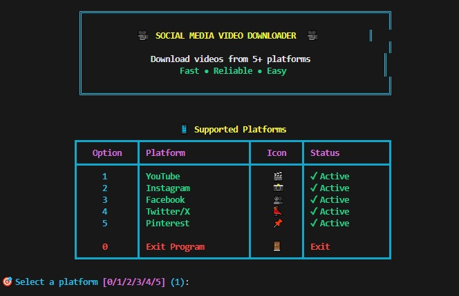
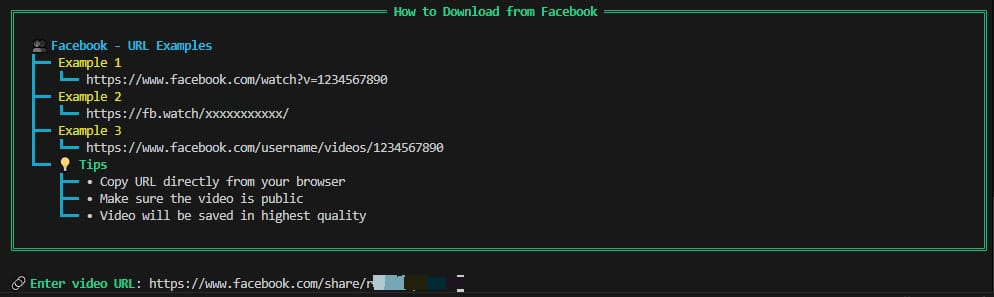
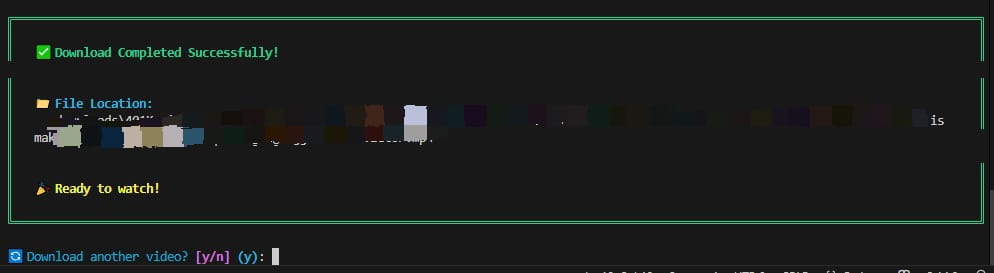

# 🎥 Social Media Video Downloader

<div align="center">


**A professional, interactive CLI tool for downloading videos from multiple social media platforms**

[Features](#-features) • [Installation](#-installation) • [Usage](#-usage) • [Platforms](#-supported-platforms) • [Contributing](#-contributing)

</div>

---

## ✨ Features

- 🎨 **Beautiful CLI Interface** - Rich, colorful, and interactive terminal UI
- 🚀 **Multi-Platform Support** - Download from 5+ popular platforms
- 📊 **Real-time Progress** - Visual progress bars with speed and ETA
- 🔍 **Smart URL Detection** - Automatically detects platform from URL
- 💾 **Highest Quality** - Downloads videos in the best available quality
- 📈 **Download Statistics** - Track your download history
- 🛡️ **Error Handling** - Comprehensive error messages with troubleshooting tips
- 🎯 **URL Examples** - Built-in guide for each platform
- ⚡ **Fast & Reliable** - Powered by yt-dlp

## 🎬 Supported Platforms

| Platform | Status | Video Types |
|----------|--------|-------------|
| 🎬 YouTube | ✅ Active | Videos, Shorts, Live Streams |
| 📸 Instagram | ✅ Active | Reels, Posts, IGTV |
| 👥 Facebook | ✅ Active | Videos, Watch |
| 🐦 Twitter/X | ✅ Active | Videos, GIFs |
| 📌 Pinterest | ✅ Active | Video Pins |

## 📦 Installation

### Prerequisites

- Python 3.8 or higher
- pip (Python package manager)

### Quick Install

1. **Clone the repository**
```bash
git clone https://github.com/A7meD-XD/video_downloader.git
cd video-downloader
```

2. **Install dependencies**
```bash
pip install -r requirements.txt
```

3. **Run the application**
```bash
python video_downloader.py
```

### Alternative Installation

```bash
# Install directly with pip
pip install yt-dlp rich

# Then run
python video_downloader.py
```

## 🚀 Usage

### Interactive Mode (Recommended)

Simply run the script and follow the interactive prompts:

```bash
python video_downloader.py
```

The application will guide you through:
1. Selecting a platform
2. Viewing URL examples
3. Entering the video URL
4. Confirming the download
5. Tracking download progress

### Example Workflow

```
🎥  SOCIAL MEDIA VIDEO DOWNLOADER  🎥

📱 Supported Platforms
┏━━━━━━━━┳━━━━━━━━━━━┳━━━━━━┳━━━━━━━━━━━━━┓
┃ Option ┃ Platform  ┃ Icon ┃    Status   ┃
┡━━━━━━━━╇━━━━━━━━━━━╇━━━━━━╇━━━━━━━━━━━━━┩
│   1    │ YouTube   │  🎬  │ ✓ Active    │
│   2    │ Instagram │  📸  │ ✓ Active    │
└────────┴───────────┴──────┴─────────────┘

🎯 Select a platform: 1

💡 YouTube URL Examples:
   • https://www.youtube.com/watch?v=xxxxx
   • https://youtu.be/xxxxx

🔗 Enter video URL: [paste your URL here]
```

## 📸 Screenshots

<div align="center">

### Main Menu


### Download Progress


### Success Message


</div>

## 🎨 Features Showcase

### Object-Oriented Design
```python
# Clean, modular architecture
- Platform: Platform configurations
- UIManager: All UI/UX elements
- VideoDownloader: Core download logic
- DownloadProgressHook: Progress tracking
```

### Rich Terminal UI
- Animated banners
- Colorful tables and panels
- Interactive prompts
- Progress bars with speed indicators
- Error messages with troubleshooting tips

### Smart Features
- **URL Validation**: Detects platform automatically
- **Download History**: Track all downloads in session
- **Statistics**: View download summary before exit
- **Error Recovery**: Helpful tips for common issues

## ⚙️ Configuration

### Custom Output Directory

By default, videos are saved to `./downloads/`. To change this, modify the `VideoDownloader` initialization:

```python
downloader = VideoDownloader(output_dir="your/custom/path")
```

### Quality Settings

The application automatically selects the best quality. To customize:

```python
# In configure_ydl_options method
'format': 'bestvideo[height<=1080]+bestaudio/best[height<=1080]'  # Limit to 1080p
```

## 🐛 Troubleshooting

### Common Issues

**Problem**: "Missing required libraries"
```bash
# Solution
pip install -r requirements.txt
```

**Problem**: "Unable to download video"
```bash
# Solution: Update yt-dlp
pip install -U yt-dlp
```

**Problem**: Video is private/unavailable
- Ensure the video is public
- Check if you need to be logged in
- Verify the URL is correct

## 🤝 Contributing

Contributions are welcome! Here's how you can help:

1. **Fork the repository**
2. **Create a feature branch**
   ```bash
   git checkout -b feature/AmazingFeature
   ```
3. **Commit your changes**
   ```bash
   git commit -m 'Add some AmazingFeature'
   ```
4. **Push to the branch**
   ```bash
   git push origin feature/AmazingFeature
   ```
5. **Open a Pull Request**

### Development Setup

```bash
# Install development dependencies
pip install -r requirements.txt

# Run tests (if available)
pytest tests/

# Format code
black video_downloader.py

# Lint code
flake8 video_downloader.py
```

## 📝 License

This project is licensed under the MIT License - see the [LICENSE](LICENSE) file for details.

## 🙏 Acknowledgments

- [yt-dlp](https://github.com/yt-dlp/yt-dlp) - Powerful video downloader
- [Rich](https://github.com/Textualize/rich) - Beautiful terminal formatting
- All contributors and users

## 📧 Contact

Your Name - [@A7meDX](https://www.youtube.com/@A7meDX)

Project Link: [https://github.com/A7meD-XD/video_downloader](https://github.com/A7meD-XD/video_downloader)

---

<div align="center">

**⭐ If you find this project useful, please consider giving it a star!**

Made with ❤️ and Python

</div>
